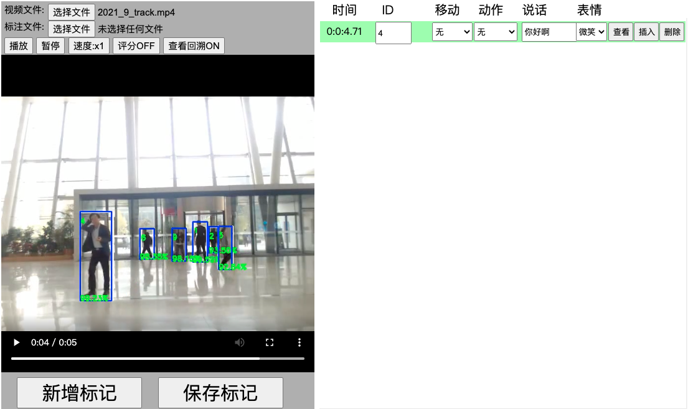

# TFVF-HRI

[Interactive Learning for Robot Proactive Social Greetings](https://arxiv.org/abs/2012.04832)


## Preparation

```sh
sh scripts/download_pretrain_models.sh
sh tools/darknet_to_paddle.sh
```

## Collecting Videos

You need to organize the collected video clips into folder `data/clips`, then preprocess them using multiple objects tracking, i.e., execute:

```txt
# in data/clips

video_1.mp4
video_2.mp4
...
```

```sh
# Assuming that we run 2 workers
python scripts/collect_v2_data.py -w 2 -c 1 -d data/clips &
python scripts/collect_v2_data.py -w 2 -c 2 -d data/clips &

# For more help information
python scripts/collect_v2_data.py --help
```

Notice that this script would spawn several workers to make the preprocessing fast. After it finished, your clips folder would looks like:

```txt
# in data/clips

video_1.mp4
video_1_track.mp4
video_1_states.pkl
video_2.mp4
video_2_track.mp4
video_2_states.pkl
...
```

**Notice**: to alleviate the accumulated errors of multiple objects tracking, do not make the video clips too long, maybe several minutes.

## Annotation

We developed a web-based annotation platform and you can start the server by running:

```sh
sh scripts/run_anno_platform.sh
```



Then, open the *index.html*, load the video, select the suitable timestamps by clicking "add annotation", and fill the suitable multi-modal actions.

Next, clik the "save" button to download a txt file that has a prefix from the video filename. Finally move them to folder `data/annos`.

**Notice**: for video clips as full negative examples, please save a null txt file, otherwise the video would be ignored.

## Generating Datasets

After collected and annotated raw datasets, we need to split them and generate datasets that the dataloader can use.

**Step I**: create the initial representation of the multi-modal actions.

```sh
python scripts/collect_act_emb.py -ad data/annos
```

**Step II**: split positve examples and sample negative examples.

```sh
python scripts/prepare_dataset.py -dv ds -ad data/annos -vd data/clips
python scripts/prepare_dataset.py -dv ds_decord
```

## Training the Model

```sh
sh scripts/attn_model.sh
```

## Deploying the Model

First, use `scripts/save_infer_model_params.py` to get paddle inference model.

```sh
# Assume you got trained model 'saved_models/attn/epoch_10'
python scripts/save_infer_model_params.py saved_models/attn/epoch_10 \
    jetson/attn data/raw_wae/wae_lst.pkl visual_token
```

Second, setup Jetson environment following `jetson/Jetson_INSTALL.md`.

Thrid, configurate variables in the `jetson/run.sh`, use `sh run.sh` to compile and run the `jetson/infer_v3.cpp`. This would start a gRPC server and accept requests according to `jetson/proactive_greeting.proto`.
